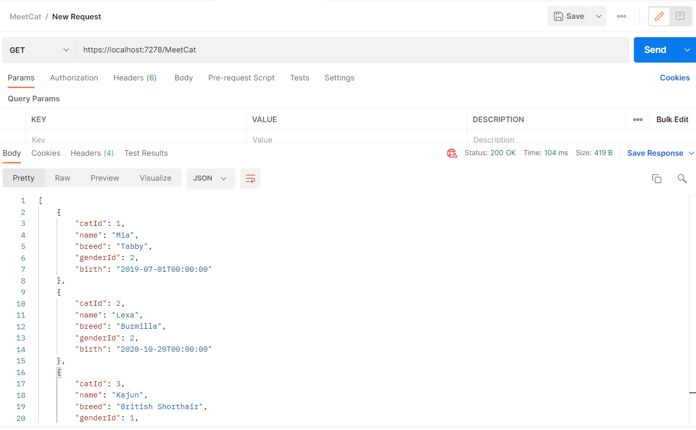
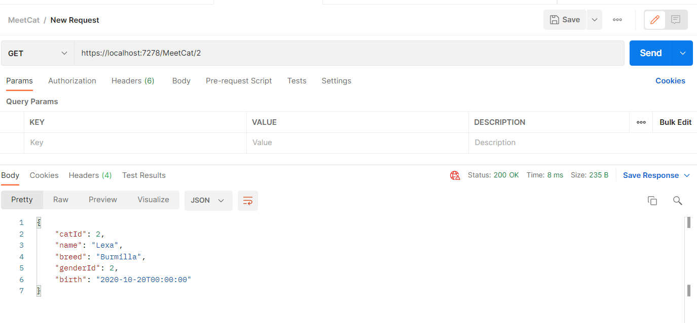
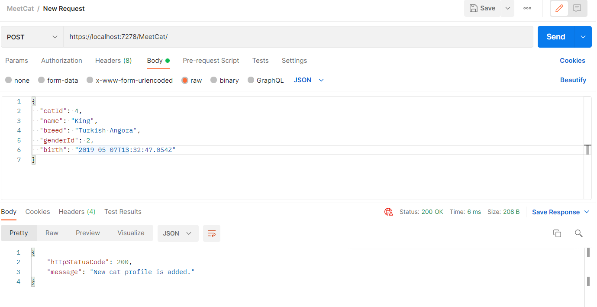
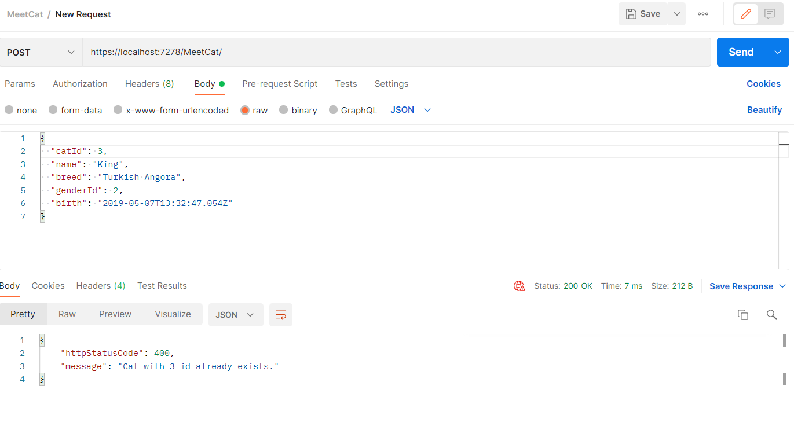
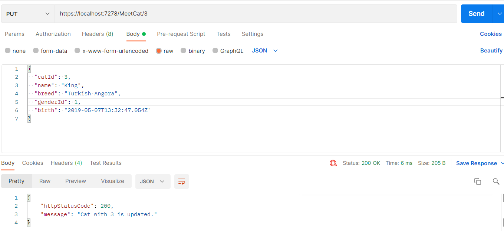
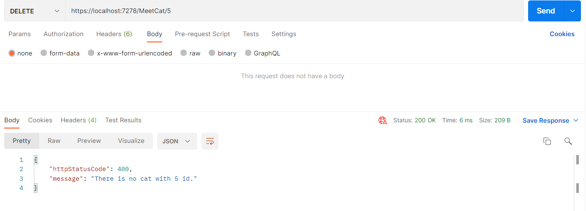

I put postman screenshots here. You can also take a look at the [Swagger UI screenshots](https://github.com/AKBANK-Patika-FullStack-Bootcamp/CansuYanik_Homeworks/tree/main/Week2/Swagger%20UI%20Screenshots) if you want.

###Get Method

-------------------------------------------

###GetByID Method

-------------------------------------------

###Post Method

-------------------------------------------

###Post Method With Error
Given id already exists in the list.

-------------------------------------------

###Put Method

-------------------------------------------

###Put Method With Error
There is no such id in the list to update.

-------------------------------------------

###Get New Profile after Post and Put Methods

-------------------------------------------

###Delete Method

-------------------------------------------

###Delete Method With Error
There is no such id in the list to delete.

-------------------------------------------

###Get List after Delete Method

